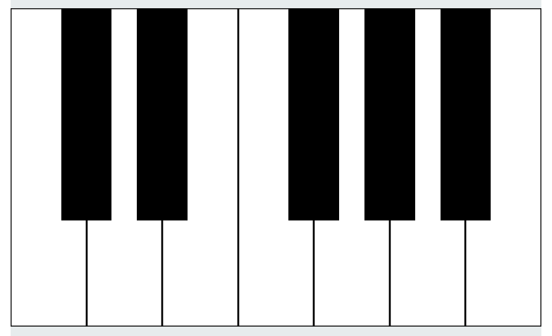
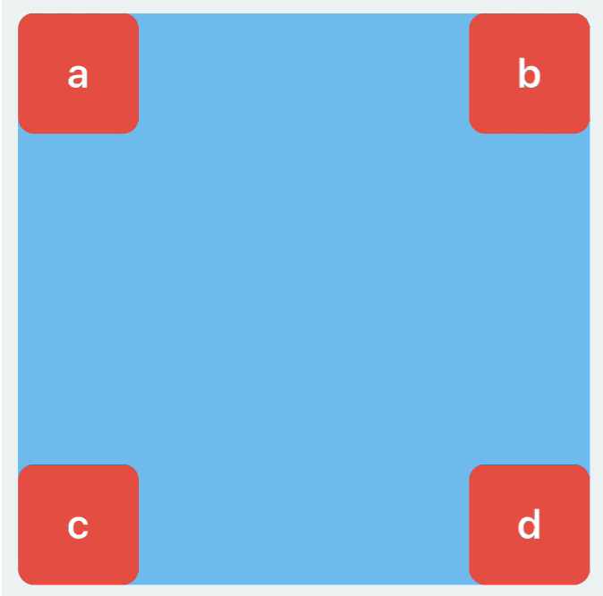
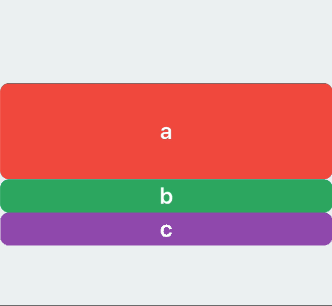

# Anchors

[](https://travis-ci.org/onmyway133/Anchors)
[](http://cocoadocs.org/docsets/Anchors)
[](https://github.com/Carthage/Carthage)
[](http://cocoadocs.org/docsets/Anchors)
[](http://cocoadocs.org/docsets/Anchors)


## Story

I like to build view in code, so Auto Layout is my definite choice. The syntax has improved over the years, but I always want to do it with minimum effort. More repetitive code makes you tend to do copy paste and produce more bugs.

### Auto Layout APIs history

How new APIs were introduced over the years, so you know to set your deployment target

- `NSLayoutConstraint` since iOS 6, macOS 10.7
- `isActive` since iOS 8, macOS 10.10
- `NSLayoutAnchor`, `UI|NSLayoutGuide` since iOS 9, macOS 10.11

### Do you need a another Auto Layout framework?

All the Auto Layout frameworks you see are just convenient ways to build `NSLayoutConstraint`, in fact these are what you normally need

- Call `addSubview` so that view is in hierarchy
- Set `translatesAutoresizingMaskIntoConstraints = false`
- Set `isActive = true` to enable constraints

Most of the time, `NSLayoutAnchor` is what you need. But if you need more, **Anchors** can be your choice. This is how to make a piano using **Anchors**
More example can be found in [Example](https://github.com/onmyway133/Anchors/tree/master/Example/AnchorsDemo)

<div align = "center">

</div>

```swift
activate(
  c.anchor.left,
  b.anchor.right,
  c.anchor.top.bottom,
  c.anchor.top.bottom.width.apply(to: [d, e, f, g, a, b]),
  c.anchor.fixedSpacingHorizontally(togetherWith: [d, e, f, g, a, b], spacing: 0)
)

activate(
  cd.anchor.top,
  cd.anchor.size.equal.to(c.anchor.size).multiplier(2/3),
  cd.anchor.top.size.apply(to: [de, fg, ga, ab]),
  cd.anchor.centerX.equal.to(c.anchor.right),
  de.anchor.centerX.equal.to(d.anchor.right),
  fg.anchor.centerX.equal.to(f.anchor.right),
  ga.anchor.centerX.equal.to(g.anchor.right),
  ab.anchor.centerX.equal.to(a.anchor.right)
)
```

## Features

- [x] Fluent builder syntax
- [x] Easy to customize with protocol based
- [x] Support iOS 9+, macOS 10.11+
- [x] Support `LayoutGuide`
- [x] Update and reset constraints
- [x] Find existing constraints
- [ ] Debug constraints
- [ ] Visualize constraints

## Basic with Anchor

#### Access Anchor

Prefer composition over extension, this is how you access `anchor`

```swift
let view = UIView()
view.anchor.left.right

let guide = UILayoutGuide()
guide.anchor.width.height
```

#### Activate constraints

Use `activate` which accepts variadic parameters. This is important, no matter how you create constraints, you need to `activate` it 🚀

```swift
activate(
  a.anchor.top.left,
  b.anchor.top.right,
  c.anchor.bottom.left,
  d.anchor.bottom.right
)
```

<div align = "center">

</div>

#### Attributes
Supports all attributes you can think of

```swift
anchor.top.left.bottom.right
  .leading.trailing
  .topMargin.bottomMargin.leftMargin.rightMargin
  .centerX.centerY
  .centerXWithinMargins.centerXWithinMargins
  .lastBaseline.firstBaseline
  .width.height
```

#### Relation

```swift
a.anchor.top.equal.to(b.bottom)
a.anchor.width.greaterThanOrEqual.to(b.anchor.height)
a.anchor.width.lessThanOrEqual.to(b.anchor)
``` 

#### Configuration
This is how to apply `constant`, `multiplier`, `priority`, `identifier`

```swift
a.anchor.top.equal.to(b.anchor.bottom)
  .constant(10).multiplier(1.5).priority(999)
  .id("verticalSpacingBetweenA-B")
```

#### Reference
Get references to constraints to modify it later on. In the `ref` closure, we get access to all the created constraints

```swift
var constraint: NSLayoutConstraint?
activate(
  view.anchor.center.constant(10).ref({ constraint = $0.first })
)
```

#### Convenient attributes

Use convenient attributes which combine multiple inner attributes

```swift
a.anchor.center // centerX, centerY
a.anchor.size // width, height
a.anchor.edges // top, right, bottom, left
```

#### Convenient methods

Insets

```swift
a.anchor.edges.insets(EdgeInsets(top: 1, left: 2, bottom: 3, right: 4)) // top+1, left+2, bottom+3, right+4
a.anchor.edges.insets(5)	// top+5, left+5, bottom-5, right-5
```

Padding

```swift
a.anchor.paddingHorizontally(20) // leading+20, trailing-20
b.anchor.paddingVertically(20)	// top+20, bottom-20
```

#### Size

Size to another anchor

```swift
a.anchor.height.equal.to(b.anchor.width)
c.anchor.size.equal.to(d.anchor)
```

Size to a constant

```swift
a.anchor.height.equal.to(20)	// height=20
b.anchor.size.equal.to(20)	// width=20, heigh=20
```

Alernatively, you can just use constant

```swift
c.anchor.width.constant(20) // width=20
```


#### Ratio

```swift
a.anchor.height.equal.to(a.anchor.width) // height=width
```

## Find existing constraints

You don't need to declare variables to store `constraints`, you can just retrieve them back

```swift
a.anchor.find(.height)?.constant = 100

// later
b.anchor.find(.height)?.constant = 100

// later
c.anchor.find(.height)?.constant = 100
```

<div align = "center">

</div>

## Animation

Animation is simple. You just change your `constraint` 's `isActive` or `constant` properties, then `layoutIfNeeded` in an animation block. You can use `UIView.animate` or `UIViewPropertyAnimator`

```swift
// Change constraint
a.anchor.find(.height)?.constant = 100
loginButtonHeightConstraint.isActive = false

let animator = UIViewPropertyAnimator(duration: 1, dampingRatio: 0.7)
animator.addAnimations { [weak self] in
  self?.view.layoutIfNeeded()
}

animator.startAnimation(afterDelay: 1)
```


## Update constraints with Group

## Customize with ConstraintProducer

## Build quickly with Builder

## Debug

## Support multiple screen sizes 

## Installation

**Anchors** is available through [CocoaPods](http://cocoapods.org). To install
it, simply add the following line to your Podfile:

```ruby
pod 'Anchors'
```

**Anchors** is also available through [Carthage](https://github.com/Carthage/Carthage).
To install just write into your Cartfile:

```ruby
github "onmyway133/Anchors"
```

**Anchors** can also be installed manually. Just download and drop `Sources` folders in your project.

## Author

Khoa Pham, onmyway133@gmail.com

## Contributing

We would love you to contribute to **Anchors**, check the [CONTRIBUTING](https://github.com/onmyway133/Anchors/blob/master/CONTRIBUTING.md) file for more info.

## License

**Anchors** is available under the MIT license. See the [LICENSE](https://github.com/onmyway133/Anchors/blob/master/LICENSE.md) file for more info.
